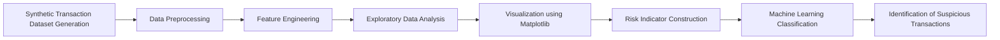

# Money Laundering Detection using Machine Learning on Synthetic Banking Transactions

## Project Overview

This project demonstrates a machine learning–based Anti-Money Laundering (AML) detection system designed to identify suspicious financial transaction behavior using a large-scale synthetically generated banking dataset.

Due to regulatory restrictions, real AML datasets cannot be publicly shared. Therefore, a realistic transaction dataset containing 2 million simulated customer records was generated using Python, NumPy, and Pandas to replicate real-world banking transaction characteristics.

The project simulates how financial institutions detect suspicious activities using behavioral risk indicators and machine learning workflows.

---

## Business Objective

Banks are required to monitor transactions continuously to detect potential money laundering activities.

Traditional rule-based AML systems generate large numbers of alerts and require manual investigation.

This project demonstrates how machine learning techniques can support:

Suspicious transaction detection
Risk-based customer profiling
Transaction behavior monitoring
Fraud risk surveillance automation

This workflow reflects practical AML monitoring logic used in banking fraud risk departments.

---

## Dataset Description

A synthetic AML transaction dataset containing **2,000,000 customer transaction records** was generated programmatically using Python.

The dataset simulates realistic banking transaction characteristics including:

Customer income level
Transaction frequency
International transaction behavior
High-risk country indicators
KYC compliance status
Industry risk category
Account age
Transaction timing patterns

Approximately **5% suspicious transaction behavior** was intentionally simulated to replicate real-world AML monitoring conditions.

---

## AML Detection Workflow

---

## Feature Engineering Strategy

The project constructs behavioral indicators commonly used in AML monitoring pipelines:

High transaction frequency detection
International transfer monitoring
High-risk geography indicators
Income-to-transaction mismatch signals
Industry-based risk indicators
KYC compliance monitoring
Account age behavior tracking

These indicators simulate real-world suspicious activity monitoring logic.

---

## Technologies Used

Python
NumPy
Pandas
Matplotlib
Scikit-learn

---

## Exploratory Data Analysis

Matplotlib visualizations were used to analyze transaction behavior patterns and detect relationships between:

Income vs transaction activity
Country risk vs suspicious behavior
Account age vs risk indicators
Industry risk category distribution

These visual insights support fraud risk interpretation before model training.

---

## Machine Learning Approach

A classification-based machine learning workflow was implemented to identify suspicious transactions based on engineered behavioral risk indicators.

The model evaluates transaction patterns and classifies records as:

Normal transaction behavior
Suspicious transaction behavior

This simulates intelligent alert-generation pipelines used in AML monitoring systems.

---

## Model Evaluation Metrics

Model performance was evaluated using:

Accuracy
Precision
Recall
F1 Score
Confusion Matrix Analysis

These metrics measure effectiveness of suspicious activity detection.

---

## Results

The project successfully demonstrates:

Large-scale synthetic AML dataset simulation

Construction of transaction risk indicators

Behavioral fraud-risk visualization

Machine learning–based suspicious transaction detection workflow

The solution reflects how AML analytics pipelines operate inside banking fraud monitoring environments.

---

## Real-World Banking Applications

This system can support:

Suspicious transaction monitoring

Customer risk scoring

High-risk geography detection

KYC compliance monitoring

Transaction anomaly detection

Financial crime analytics pipelines

---

## Future Enhancements

Add anomaly detection models such as Isolation Forest

Build network-based transaction relationship modeling

Deploy real-time monitoring dashboard using Streamlit

Integrate graph-based fraud detection techniques

Extend simulation with temporal transaction behavior modeling

---

## Author

Sneha Kolge

Fraud Risk Management Professional | Data Science Enthusiast

Domain Experience

Banking Operations
Fraud Risk Monitoring
AML Detection
Transaction Analytics
Financial Crime Investigation Support
